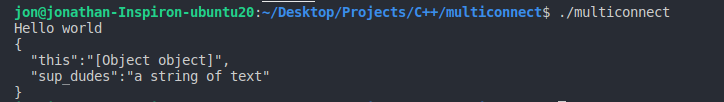

# dynobj

A dynamic object library written in C

Depends on:
[jwerle/murmurhash](https://github.com/jwerle/murmurhash.c) (included in source)

The hashing algorithm isn't super important, I just needed something to work with for now

## What
Think JavaScript objects, where you can set properties during runtime, but in portable C

## Why
I'm writing a microkernel OS that runs javascript/typescript and needed dynamic objects

Also dynamic objects are great for rapid prototyping

## State
Functional, not ready for production

## API

TODO
- object_create
- object_get_property
- object_has_property
- object_create_property
- object_set_property
- object_set_dirty
- object_get_property_count
- object_print_json
- object_to_jsonstr (not operational)
